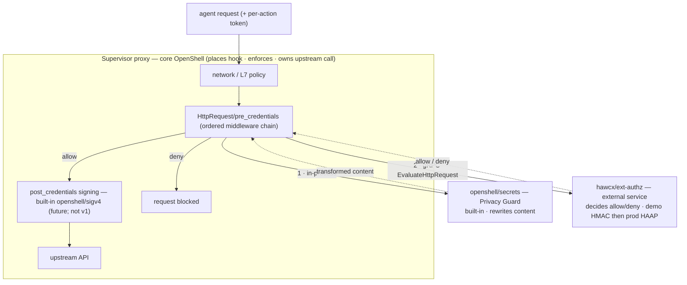

# OpenShell ext-authz middleware (reference implementation)

A small, runnable **external per-action authorization** middleware for OpenShell's supervisor
egress hook (RFC 0009, tracked by [NVIDIA/OpenShell#1733](https://github.com/NVIDIA/OpenShell/issues/1733)).
It binds each outbound agent action to an allow/deny decision over the *exact bytes* of the
request: for every request it asks an out-of-process verifier ("guard service") "is *this*
action allowed?" and returns a verdict the supervisor enforces before the request leaves the
sandbox. Change the request after it's authorized and the call is dead at the edge.

It's a *second, independent* consumer of the `HttpRequest/pre_credentials` hook — an
authorizer, offered partly to keep that interface honest about carrying more than one kind of
middleware. (Privacy Guard, the redaction middleware that motivated the hook, is a different
job on the same contract: it *rewrites* request content where this *decides* allow/deny. More
on that in [Where each piece lives](#where-each-piece-lives) below.)

> **Status:** reference / illustrative. The verifier validates a deliberately simple demo
> token (HMAC over JSON claims) — *not* the real HAAP wire format — and the
> middleware↔verifier transport here is plain HTTP/JSON, a dependency-free stand-in for the
> **gRPC** contract RFC 0009 specifies (`EvaluateHttpRequest`). What carries over unchanged
> is the *shape* — the request descriptor, the allow/deny verdict, the per-action semantics
> — not the wire format.
>
> **License:** Apache-2.0 (matches OpenShell) — see [`LICENSE`](LICENSE) in this directory,
> which governs this subtree notwithstanding the repository root license — so it can drop
> into the RFC's `examples/` as-is.
>
> **Reviewed:** see [`AUDIT.md`](AUDIT.md) for the validity/correctness self-audit (method,
> findings, and what is demo-only vs production).

## Where each piece lives

Three kinds of component; only the external service is ours to write.

| Component | Who owns it | Job |
|---|---|---|
| **Supervisor proxy** (core OpenShell) | OpenShell | Runs the `HttpRequest/pre_credentials` hook, calls the configured middleware, **enforces** the allow/deny, owns the upstream call. Unchanged by this example. |
| **A middleware on the hook** | built-in = OpenShell; external = operator / third party | **Decides**: inspects the request, returns allow/deny (+ optional transform/metadata). Never makes the upstream call. Built-ins run in-process under the reserved `openshell/` namespace (Privacy Guard = `openshell/secrets`; `openshell/sigv4`); external ones are operator-run gRPC services. |
| **The external service** (the verifier) | whoever runs it | Holds the decision logic. Demo = HMAC stand-in; production = the Hawcx HAAP verifier. The only piece Hawcx owns. |



**Privacy Guard vs. this authorizer** are two *different* middlewares on the same hook, not
one component with two modes. Privacy Guard *rewrites* content to redact secrets; the
authorizer *returns allow/deny* and changes nothing. Same contract, opposite jobs. Their
only relationship is chain order: a content-rewriter must run **before** the authorizer, so
the authorizer's decision binds the bytes that actually egress.

**A note on this repo's split.** The demo shows a thin in-proxy "middleware" that hashes the
request and then calls a separate "verifier" over HTTP. That two-process split is an artifact
of using a plain-HTTP stand-in. In a real RFC 0009 integration the supervisor calls the
external service directly over gRPC, and the authorization logic (hashing the egressing
request, checking the token) lives in that service. There is no Hawcx "middleware layer"
inside your proxy — there is the supervisor calling an external service. The decision is the
service's; the enforcement stays core's.

**Demo → production — what changes:**

| Reused unchanged | Replaced for production |
|---|---|
| The request/verdict contract *shape* | The token: demo HMAC-over-JSON → HAAP (attested, per-call, proof-bound) |
| The canonical request-hash discipline (`crh_v1`) | The service internals: HMAC check → HAAP verifier |
| The `pre_credentials` ordering + fail-closed default | The replay store: in-memory → shared, TTL-bounded |
| The supervisor proxy and its enforcement | The transport: illustrative HTTP `/v1/authorize` → RFC 0009 gRPC `EvaluateHttpRequest`, over mTLS |

Everything the platform integrates against stays put; only what sits behind the service
boundary — the token and the verifier — changes.

## Why it's interesting for RFC 0009 / #1733

* The expensive capability — request-content access at the egress stage — is **already
  required by Privacy Guard**, so a per-action authorizer is nearly free to add on the same
  hook. And RFC 0009 already gives an authorizer what it needs: a first-class
  **`allow`/`deny`** decision (deny short-circuits the chain), the
  `HttpRequest/pre_credentials` stage (before credential injection), and raw-value-free
  audit/findings.
* It exercises the **ordering** rule: the authorizer's decision must bind *the bytes that
  egress*, so it runs **after** any content-rewriting middleware (Privacy Guard) and
  **before** credential injection — exactly the `pre_credentials` placement. The
  credential-visible signing step (the future `post_credentials` hook, built-in
  `openshell/sigv4`; cf. [#1638](https://github.com/NVIDIA/OpenShell/pull/1638)) runs after
  and is action-neutral, so it never changes what the authorizer bound.
* It is a worked **second consumer** that pressure-tests whether the contract is general
  rather than Privacy-Guard-shaped — and it surfaces a few things worth settling in the RFC,
  offered as **proposals, not assumptions** (see [Open interface questions](#open-interface-questions-for-the-rfc)).

## The authorization subject: the durable agent (a proposal)

For an authorizer, the subject a grant or a revocation is *about* is the **durable agent**
(acting for a human, within a mandate), not the sandbox it happens to run in — a sandbox is
ephemeral and gets a new id on respawn. So this reference keys the verdict on the agent
(`AGENT_MISMATCH` / `AGENT_REVOKED`) and treats the sandbox as optional workload context
(`WORKLOAD_MISMATCH`). The headline demo scenario is *"agent respawned into a new sandbox →
still allowed; revoke the agent → denied everywhere."*

This is a **proposal about the hook context, not a description of it.** RFC 0009 v1 surfaces
only `originating_process` (binary / pid / ancestor chain), which it explicitly notes is
per-connection and not to be over-trusted for per-request attribution — there is no durable
agent identity in the v1 context today. A durable `agent_id` is an improvement *only if it is
attested at least as well as* what it replaces; a bare string is self-asserted and would be a
regression. So the field is meaningful only once an attestation source exists (the in-flight
IdP / enrolled-identity work), and we raise it as a later-phase RFC question — alongside RFC
0009's own phase-2 trust-boundary question — not a v1 ask. In this reference `agent_id` is a
plain string the gateway is assumed to attest; a real integration backs it with enrolled
identity material (HAAP).

## Layout

```
crates/
  ext-authz-core/        wire contract + the canonical request hash (crh_v1) + config; no I/O
  ext-authz-middleware/  the in-proxy seam: extract token, hash, call verifier, map the
                         verdict (the supervisor enforces), audit
  ext-authz-demo/        a reference HAAP-shaped verifier + a scenario driver (also a smoke test)
policy-example.yaml      an illustrative RFC 0009 / #1694-shaped middleware policy block
demo/index.html          a self-contained interactive visual of one decision (blog / keynote)
```

(This is the repo's structure, not the OpenShell architecture — for what-sits-where in
OpenShell's terms see [Where each piece lives](#where-each-piece-lives).)

## Quickstart

```bash
# Self-contained end-to-end demo (spins a verifier in-process, runs 11 scenarios).
cargo run --bin ext-authz-demo -- demo

# Same scenarios, walked one at a time with pauses — built to be screen-recorded.
cargo run --bin ext-authz-demo -- demo --story

# Run the reference verifier as a standalone service.
cargo run --bin ext-authz-demo -- verifier --listen 127.0.0.1:18443

# Tests (unit + integration) and lints.
cargo test --workspace
cargo clippy --workspace --all-targets -- -D warnings
```

The demo prints a PASS/DENY line per scenario and one audit event; it exits non-zero if any
scenario deviates from its expected outcome.

## The request lifecycle

```
agent request (+ per-action token)
  → network / L7 policy             (OpenShell admits the request)
  → content-rewriting middleware     (e.g. Privacy Guard / openshell/secrets)  ── BEFORE the authorizer
  → the authorizer                   (hash the egressing request, ask the
                                      verifier, return allow/deny)              ── LAST pre-credential step
  → credential injection / signing   (post_credentials; built-in openshell/sigv4) ── action-neutral; never seen by the authorizer
  → upstream API
```

The supervisor places the hook and **enforces** the returned decision; the authorizer only
decides. The per-action token must reach the verifier but never the upstream destination —
how it is carried and stripped is an open interface question (below), because in RFC 0009 v1
middleware cannot remove headers and the supervisor owns credentials.

## The contract (illustrative)

The demo uses one HTTP round trip per request — `POST /v1/authorize` with an
`AuthorizeRequest` (request descriptor + `crh_v1` + context + the forwarded per-action
token), answered by an `AuthorizeResponse` (`{ decision, reason_code, message?, receipt_id?,
evidence? }`). This is a **dependency-free stand-in for RFC 0009's gRPC
`EvaluateHttpRequest` / `HttpRequestResult`**; the field *shape* is what transfers, not the
HTTP/JSON wire.

The verifier MUST recompute `crh_v1` from the descriptor and reject on mismatch
(`CRH_MISMATCH`) — it never trusts the middleware's hash blindly.

### `crh_v1` — the canonical request hash (our proposed digest)

A canonical request hash is *not* something RFC 0009 specifies. The RFC requires
raw-value-free audit evidence; `crh_v1` is the digest **we propose** to serve that — it is
both a privacy-preserving audit key and the exact value a verifier's decision binds to. It
can stay opaque to OpenShell.

```
crh_v1 = SHA-256( "openshell-crh-v1\0"
    || u32_be(len) || method      (uppercased)
    || u32_be(len) || scheme      (lowercased)
    || u32_be(len) || authority   (lowercased; default port stripped)
    || u32_be(len) || path        (bytes as forwarded; "" -> "/")
    || u32_be(len) || query        (bytes after '?', as forwarded)
    || u32_be(32)  || sha256(body) )
```

Length-prefixed (no concatenation ambiguity), normalized only for case/default-port, **not**
semantically (no percent-decoding, no query reordering — that would re-open request-smuggling
gaps). Body is hashed, never embedded, so the descriptor and the audit trail stay free of raw
content.

## Configuration

See `policy-example.yaml`. Two orthogonal knobs govern degraded behavior:

* `mode`: `enforce` (verdicts block) vs `observe` (never block; log the would-be verdict — a
  canary/rollout mode).
* `fail`: `closed` (verifier unreachable ⇒ deny; the RFC 0009 `on_error: fail_closed`
  default) vs `open` (verifier unreachable ⇒ pass, audited as degraded).

## Security model & deployment requirements

The middleware's guarantees are conditional on the host honoring three contracts:

1. **Ordering.** The request the proxy forwards must be byte-identical to what was hashed —
   so the authorizer runs *after* all content-rewriting middleware and *before* credential
   injection. The crh deliberately excludes headers (the semantic action is method + target +
   body); header normalization before this stage is the host's job.
2. **Carrying and stripping the per-action token.** The token must reach the verifier but
   never the upstream destination. In this demo the middleware names the header to strip and
   the host removes it (and refuses a request carrying more than one token header,
   `TOKEN_AMBIGUOUS`, rather than first-matching). Note this does **not** map onto RFC 0009
   v1, where middleware may only *append* safe headers, never remove them — the supervisor
   owns credentials. The clean model is to treat the per-action token as a supervisor-owned
   credential placeholder the hook receives in context and the supervisor strips before
   egress; see [Open interface questions](#open-interface-questions-for-the-rfc).
3. **Verifier transport.** The per-action credential crosses to the verifier and the verifier
   dispenses ALLOW verdicts, so this channel MUST be mutually authenticated and confidential —
   a loopback unix socket with restrictive permissions, or mTLS (RFC 0009's phase-2 guidance
   for supervisor↔service auth). The middleware warns at construction on a plaintext
   non-loopback `verifier_url`.

The verifier independently rejects a non-canonical descriptor (`DESCRIPTOR_MALFORMED`) and a
non-matching hash (`CRH_MISMATCH`), and stamps `evidence.binding` (`exact` vs `coarse`) so
scope-only grants are visible in the audit trail. See [`AUDIT.md`](AUDIT.md) for the full
threat model and the demo-only-vs-production breakdown (the HMAC token, the in-memory replay
store, and the transport are all reference simplifications).

## Adapting to the real RFC interface

This crate is written against a small `EgressMiddleware::on_request(ctx, req)` seam (see
`ext-authz-middleware/src/lib.rs`). When `rfc/0009-supervisor-middleware` pins its concrete
gRPC contract, the adapter is mechanical: express the demo's HTTP `AuthorizeRequest` /
`AuthorizeResponse` as the gRPC `EvaluateHttpRequest` / `HttpRequestResult`, map the
middleware's internal `Continue`/`Deny` decision to the wire `allow`/`deny` (the verdict the
verifier already returns), and route `AuditEvent` to the OCSF audit sink. The crh
canonicalization and the verifier's checks are unaffected. Two
pieces do **not** map onto v1 as-is and are raised as open questions below.

## Open interface questions (for the RFC)

These are the contributions this example exists to surface — proposals to argue against a
runnable second consumer, not assumptions about what v1 already provides:

1. **Carrying/stripping a per-action credential.** A `pre_credentials` authorizer needs an
   inbound per-action token that reaches it but never egresses. v1 has no mechanism for this
   (middleware cannot remove headers; the supervisor owns credentials). Proposal: model it as
   a supervisor-owned credential placeholder the hook receives in context and the supervisor
   strips. This serves any pre-credentials authorizer, not just this one.
2. **A durable agent identity in the hook context.** v1 surfaces only `originating_process`
   (per-connection, not for per-request attribution). A durable, *attested* agent field would
   let grants/revocations follow the agent across sandbox respawns — contingent on an
   attestation source, so a later-phase question.
3. **A request digest in audit metadata.** RFC 0009 requires raw-value-free audit; a
   privacy-preserving request digest (this example's `crh_v1`) is one way to provide an audit
   key and the value an authorizer binds to. Offered as a proposal; the digest can stay
   opaque to OpenShell.
